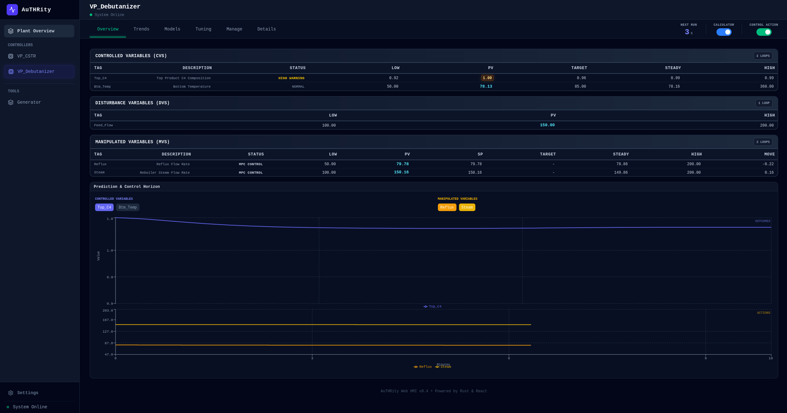
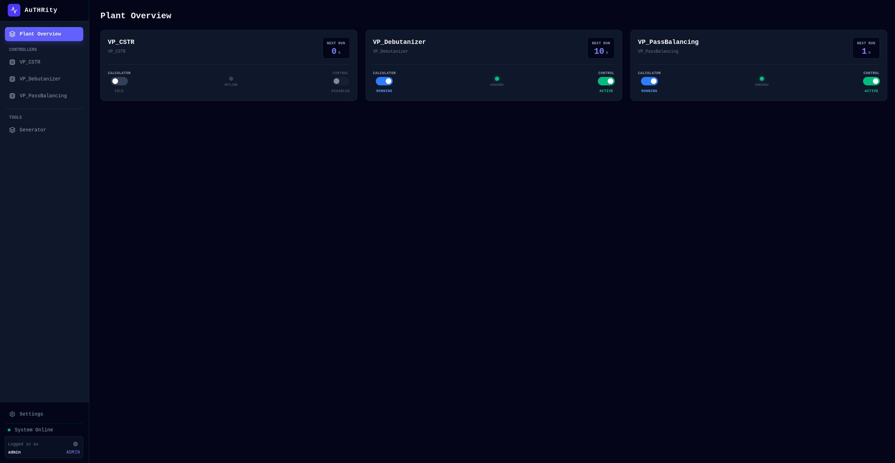
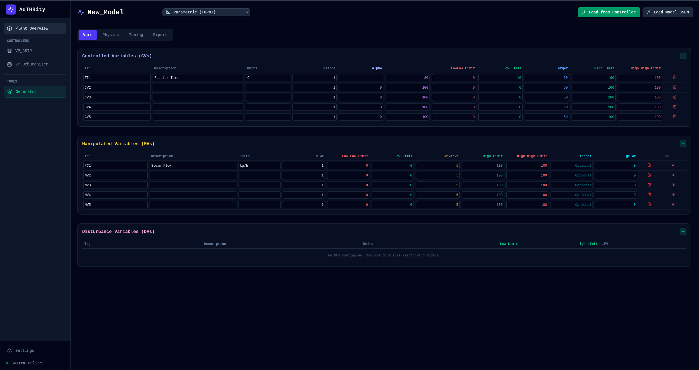
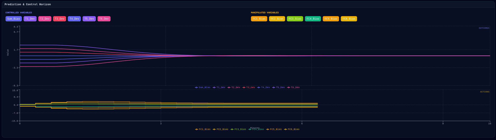

# AuTHRity

Advanced Process Control in Rust over OPC UA.

AuTHRity is an industrial Advanced Process Control (APC) platform for deploying and operating DMC/MPC controllers against live plant tags through OPC UA. It is designed for the full controller lifecycle: model creation, simulation, deployment, supervision, and operator visibility.

## Quick Overview

This system provides a practical path from model to closed-loop execution:

- **Controller execution**: `apc_engine` runs the DMC loop each scan, reads CV/MV/DV states from OPC UA, solves constrained moves, and writes setpoints when operating mode and MV mode conditions are valid.
- **Operational supervision**: `controller_host` handles deployment/versioned model storage and starts/stops controller instances as managed processes.
- **Education and system testing**: `virtual_plant` simulates representative unit behavior (Debutanizer/CSTR) for learning APC workflows and testing the AuTHRity stack behavior end-to-end.
- **Operator and engineer workflow**: `hmi` provides real-time visibility, tuning, model management, and deployment actions through a Rust backend + React frontend.
- **Interoperability**: `opcua_server` exposes/hosts process nodes so the stack can integrate with DCS/PLC environments using standard OPC UA patterns.

The design separates concerns across services so control logic, supervision, simulation, and UI can evolve independently while sharing a consistent tag model.

## Architecture Overview

```
┌─────────────────┐      OPC UA       ┌──────────────────┐
│     DCS/PLC     │◄────────────────► │  OPC UA Server   │
│                 │                   │                  │
└─────────────────┘                   └───────────────┬──┘
                                         ▲            │
                                  OPC UA │            │ OPC UA
                                         ▼            │
┌─────────────────┐           ┌──────────────────┐    │
│ Controller Host │──────────►│    APC Engine    │    │
│  (Supervisor)   │   spawns  │  (Child Process) │    │
└─────────────────┘           └──────────────────┘    │
         ▲                                            │
         │ HTTP (Control API)                         │
         │                                            │
┌────────┴───────────────────────────────┐            │
│         HMI Backend (Rust)             │◄───────────┘
│  • WebSocket Server                    │
│  • OPC UA Bridge                       │◄────►┌───────────────────────┐
└────────────────────────────────────────┘      │       QuestDB         │
         ▲                                      │  • Process Historian  │ 
         │                                      │  • Trends             │
         │ WebSocket/HTTP                       │  • step-response      │                                   
         ▼                                      └───────────────────────┘
┌────────────────────────────────────────┐
│       HMI Frontend (React/TS)          │
│  • Process Tables & Tuning             │
│  • Real-time Visualization             │
└────────────────────────────────────────┘
```

## Screenshots

Live screenshots from local runs:

### HMI Overview


### Plant Overview


### Model Management


### Model Generator (Setup)


### Model Generator (Visualization)


### Prediction & Control Horizon (Pass Balancing)


### Step Response Workflow


### FOPDT Physics View


## What Is Here

- `opcua_server`: OPC UA server with YAML node hot-reload API.
- `virtual_plant`: Debutanizer + CSTR simulator writing OPC UA tags.
- `apc_engine`: DMC/MPC worker that reads PV/targets and writes MV setpoints. APC concept overview: [apc_engine/APC_ENGINE_OVERVIEW.md](apc_engine/APC_ENGINE_OVERVIEW.md)
- `controller_host`: Supervisor API that deploys model JSON and starts `apc_engine`.
- `hmi`: Rust backend + React frontend over WebSocket, including a built-in DMC model builder.

See [SYSTEM_OVERVIEW.md](SYSTEM_OVERVIEW.md) for data flow details.

## HMI Model Builder

- Build DMC models in-browser: define CV/MV/DV tags, weights, limits, and tuning.
- Choose model type: parametric (FOPDT) or step response (legacy import or generated from historian data).
- Import compatible third-party DMC model data for migration and reuse.
- Step Response Tool pulls historian trends, auto-detects steps, computes coefficients, and exports JSON for import.
- Visualize step response matrices, export controller JSON + OPC UA nodes YAML, or deploy directly to live services.
- Load existing controller models into the builder for review or edits.

## Quick Start (Local Dev)

### Prerequisites

- Rust (1.70+)
- Node.js (18+)

### 1) Configure OPC UA Endpoints

Update IP/host in:

- [opcua_server/server.conf](opcua_server/server.conf)
- [hmi/config/settings.toml](hmi/config/settings.toml)
- [virtual_plant/config/settings.toml](virtual_plant/config/settings.toml)

Details in [CONFIGURATION_GUIDE.md](CONFIGURATION_GUIDE.md).

If you build a portable bundle with `copy_portable.ps1`, run `portable/CONFIGURE.ps1` to update IPs in the packaged configs.

### 2) Start Services (4 Terminals)

```bash
# Terminal 1: OPC UA server
cd opcua_server
cargo run
```

```bash
# Terminal 2: Simulator
cd virtual_plant
cargo run
```

```bash
# Terminal 3: Supervisor API
cd controller_host
cargo run
```

```bash
# Terminal 4: HMI backend (HTTP + WebSocket)
cd hmi
cargo run
```

Build the frontend before running the HMI:

```bash
cd hmi/frontend
npm install
npm run build
```

Then open http://localhost:3000.

For local development, HTTP is fine. For plant or production deployments, place HMI behind HTTPS/TLS (typically via reverse proxy) and expose `https://` / `wss://` only.


### 3) Start a Controller

- Use the HMI deploy flow to upload a model JSON, or
- Call the supervisor API to start a controller (it spawns `apc_engine`).

The engine uses CLI args for runtime config: `--model`, `--opc`, `--pki`.

## Models and Nodes

- Controller models are JSON files loaded by `apc_engine`.
- OPC UA node definitions are YAML files loaded by `opcua_server` and read by HMI.

See [apc_engine/src/config.rs](apc_engine/src/config.rs) and [apc_engine/src/modelloader.rs](apc_engine/src/modelloader.rs).

## Historian (Recommended but optional)

QuestDB logging is enabled in the HMI backend. Setup notes are in [hmi/QUESTDB_SETUP.md](hmi/QUESTDB_SETUP.md).

## Build and Test

```bash
just build-all
```

```bash
cd apc_engine
cargo test
```

## Docs

- [SYSTEM_OVERVIEW.md](SYSTEM_OVERVIEW.md)
- [CONFIGURATION_GUIDE.md](CONFIGURATION_GUIDE.md)
- [apc_engine/APC_ENGINE_OVERVIEW.md](apc_engine/APC_ENGINE_OVERVIEW.md)
- [apc_engine/DCS_ADAPTER_GUIDE.md](apc_engine/DCS_ADAPTER_GUIDE.md)
- [hmi/QUESTDB_SETUP.md](hmi/QUESTDB_SETUP.md)

## Safety Notice

This project is not certified for safety-critical use. Treat it as experimental software and validate thoroughly before any real-world deployment.

Operational guidance: validate all MPC/DMC outputs in your DCS/PLC. Use limit blocks, range checks, and rate-of-change limits on incoming setpoints, and never blindly trust any controller.

## Trademark and Affiliation Notice

This project is independent software and is not affiliated with, endorsed by, or sponsored by any DCS/PLC vendor.

Any third-party product or platform names are used only for interoperability/context. All third-party trademarks are the property of their respective owners.

## License

Apache-2.0. See [LICENSE](LICENSE).

Copyright (c) 2026 THR.
